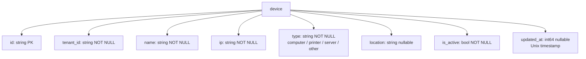

> This plan is dispatched via the CodeJob workflow. See skill: agents-workflow.

# Plan — device_manager: tenant-scoped network device inventory

## 0. Context (read first)

`device_manager` is a new `github.com/veltylabs/modules` repo, already scaffolded by `gonew`
(`git init` + initial commit + `v0.0.1` tag + pushed to `github.com/veltylabs/device_manager`).
`AGENTS.md` has already been copied into the repo root — **read it in full before writing any
code**; it is the canonical whitelist/blacklist and pattern reference for every module in this
ecosystem and overrides anything that conflicts with this plan.

**Domain**: a tenant-scoped registry of network/office equipment (computers, printers, servers,
other) — the productionized form of the UI demo at
[`tinywasm/layout/platformd/modules/devices`](https://github.com/tinywasm/layout/blob/main/platformd/modules/devices/devices.go)
(`id`/`name`/`ip` fields), extended with `type`, `location`, `is_active`. That demo is a **UI-shape
reference only** — it uses `tinywasm/dom`, `tinywasm/svg`, `tinywasm/layout/crudview` directly,
all of which are **blacklisted** for this module (see AGENTS.md's blacklist: "a concrete renderer").
Do not import any of `tinywasm/dom`, `tinywasm/svg`, `tinywasm/layout`, `tinywasm/widget` here.

**Reference implementation to copy the pattern from**: `github.com/veltylabs/item_catalog` (single
`CatalogItem` entity, ignore its second `Agreement` entity — `device_manager` has one entity:
`Device`). `github.com/veltylabs/clinical_encounter` is the reference for the current
`module.go`/`ops.go` file split (item_catalog still uses an old `mcp.go` monolith — do **not**
copy that filename or the split, only the logic).

Current state of the repo (already done, do not redo):
```
device_manager/
├── device_manager.go   # gonew stub — DELETE this file in Stage 1, its content is replaced by
│                        # model.go/module.go/ops.go/view.go below
├── go.mod               # module github.com/veltylabs/device_manager, go 1.25.2 — no requires yet
├── AGENTS.md             # copied verbatim from veltylabs/modules/AGENTS.md + domain notes filled in
├── README.md             # one-line stub — REPLACE in Stage 6
├── LICENSE
└── .gitignore
```

---

## 1. `go.mod` — dependencies

Delete `device_manager.go` (the gonew stub). Add these requires (pinned to what
`github.com/veltylabs/item_catalog`'s `go.mod` uses — the reference implementation; **run `go mod
tidy` after Stage 2** to resolve exact versions/go.sum, do not hand-edit versions beyond this
starting point):

```
require (
	github.com/tinywasm/ddl v0.0.7
	github.com/tinywasm/events v0.0.2
	github.com/tinywasm/fmt v0.25.5
	github.com/tinywasm/form v0.3.13
	github.com/tinywasm/model v0.1.2
	github.com/tinywasm/orm v0.11.4
	github.com/tinywasm/router v0.1.19
	github.com/tinywasm/time v0.5.2
	github.com/tinywasm/view v0.1.12
)
```

---

## 2. `model.go` — no build tag

Create `model.go` with this exact content:

```go
package devicemanager

import (
	"github.com/tinywasm/fmt"
	"github.com/tinywasm/form/input"
	"github.com/tinywasm/model"
)

// Exported, greppable, the ONLY place these literals exist — enum-valued column rule (AGENTS.md).
const (
	DeviceTypeComputer = "computer"
	DeviceTypePrinter  = "printer"
	DeviceTypeServer   = "server"
	DeviceTypeOther    = "other"
)

// Helpers to satisfy ormc's AST static type parser when the same Kind constructor is reused
// across more than one Definition (same defensive pattern as item_catalog/model.go).
var (
	BaseBool_FieldBool = model.Bool()
	BaseInt_FieldInt   = model.Int()
)

// deviceTypeWidget: closed-options radio widget for the `type` field — the
// form/input/gender.go pattern AGENTS.md requires for a user-editable enum.
type deviceTypeWidget struct {
	input.Base
}

func (w *deviceTypeWidget) Clone(parentID, name string) input.Input {
	clone := *w
	clone.InitBase(parentID, name, "radio")
	return &clone
}

func deviceType() input.Input {
	w := &deviceTypeWidget{}
	w.Letters = true
	w.Minimum = 1
	w.InitBase("", "", "radio")
	w.SetOptions(
		fmt.KeyValue{Key: DeviceTypeComputer, Value: "Computer"},
		fmt.KeyValue{Key: DeviceTypePrinter, Value: "Printer"},
		fmt.KeyValue{Key: DeviceTypeServer, Value: "Server"},
		fmt.KeyValue{Key: DeviceTypeOther, Value: "Other"},
	)
	return w
}

var DeviceModel = model.Definition{
	Name: "device",
	Fields: model.Fields{
		{Name: "id", Type: model.Text(), DB: &model.FieldDB{PK: true}, OmitEmpty: true},
		{Name: "tenant_id", Type: model.Text(), NotNull: true},
		{Name: "name", Type: input.Text(), NotNull: true, Permitted: model.Permitted{Minimum: 1, Maximum: 255}},
		{Name: "ip", Type: input.IP(), NotNull: true},
		{Name: "type", Type: deviceType(), NotNull: true},
		{Name: "location", Type: input.Text(), OmitEmpty: true, Permitted: model.Permitted{Maximum: 255}},
		{Name: "is_active", Type: input.Checkbox(), NotNull: true},
		{Name: "updated_at", Type: BaseInt_FieldInt, OmitEmpty: true},
	},
}

// Transport-only (Field.DB is nil on every field) — args of the ops in ops.go.

var ListDevicesArgsModel = model.Definition{
	Name: "list_devices_args",
	Fields: model.Fields{
		{Name: "tenant_id", Type: model.Text()},
		{Name: "type", Type: model.Text()},
		{Name: "active_only", Type: BaseBool_FieldBool},
		{Name: "limit", Type: BaseInt_FieldInt},
		{Name: "offset", Type: BaseInt_FieldInt},
	},
}

var GetDeviceArgsModel = model.Definition{
	Name: "get_device_args",
	Fields: model.Fields{
		{Name: "tenant_id", Type: model.Text()},
		{Name: "id", Type: model.Text()},
	},
}

var DeactivateDeviceArgsModel = model.Definition{
	Name: "deactivate_device_args",
	Fields: model.Fields{
		{Name: "tenant_id", Type: model.Text()},
		{Name: "id", Type: model.Text()},
	},
}

var DeleteDeviceArgsModel = model.Definition{
	Name: "delete_device_args",
	Fields: model.Fields{
		{Name: "tenant_id", Type: model.Text()},
		{Name: "id", Type: model.Text()},
	},
}

var (
	ErrNotFound        = fmt.Err("device not found")
	ErrIPAlreadyExists = fmt.Err("device ip already exists")
)

type ValidationError struct{ Err error }

func (v ValidationError) Error() string { return v.Err.Error() }

// <module>.<entity>.<past-tense-verb> — tenant_id goes in the event payload, never the topic name.
const (
	TopicDeviceCreated     = "device_manager.device.created"
	TopicDeviceUpdated     = "device_manager.device.updated"
	TopicDeviceDeactivated = "device_manager.device.deactivated"
	TopicDeviceDeleted     = "device_manager.device.deleted"
)
```

**Acceptance**: `go build ./...` fails at this stage (no `Device` struct yet, `model_orm.go` not
generated) — expected, resolved in Stage 3.

---

## 3. Generate `model_orm.go`

From the module root:

```bash
go install github.com/tinywasm/ormc/cmd/ormc@latest
ormc
```

This generates `model_orm.go` (`// DO NOT EDIT. generated by github.com/tinywasm/ormc`) with, per
`Definition` in `model.go`: the concrete struct (`Device`, `ListDevicesArgs`, `GetDeviceArgs`,
`DeactivateDeviceArgs`, `DeleteDeviceArgs`), `Schema()`/`Pointers()`, `EncodeFields`/`DecodeFields`,
`ModelName()`, `Validate(action byte) error`, a `Device_` meta struct of typed column names, and
`ReadOneDevice`/`ReadAllDevice` — do not hand-write any of this (see `work_schedule/model_orm.go` in
this org for the exact shape `ormc` produces, if you need to sanity-check the output).

**If `ormc` is not installable in this environment** (no network / no `go install` access): write
`model_orm.go` by hand following exactly the shape of
`github.com/veltylabs/work_schedule`'s `model_orm.go` (same org, same generator, same
`model.Definition` → struct mapping), substituting `Device`/`ListDevicesArgs`/`GetDeviceArgs`/
`DeactivateDeviceArgs`/`DeleteDeviceArgs` for `Staff`/`WorkCalendar`/etc., and field names/types from
`DeviceModel` above. `Device.Id`/`Device.TenantId`/... fields must be `string`, `Device.UpdatedAt`
must be `int64`, `Device.IsActive` must be `bool` — pure casing, `ormc` never emits `ID`/`TenantID`.

**Acceptance**: `go build ./...` still fails (no `Module`/`New` yet) — expected, resolved in Stage 4.

---

## 4. `module.go` — no build tag

Create `module.go`:

```go
package devicemanager

import (
	"github.com/tinywasm/ddl"
	"github.com/tinywasm/events"
	"github.com/tinywasm/fmt"
	"github.com/tinywasm/model"
	"github.com/tinywasm/orm"
	"github.com/tinywasm/time"
)

// Deps are the module's infrastructure ports — never a concrete implementation.
type Deps struct {
	IDs       model.IDGenerator // required — the module never builds its own
	Publisher events.Publisher  // optional — nil disables publishing silently
}

type Module struct {
	db  *orm.DB
	ids model.IDGenerator
	pub events.Publisher
}

// New connects the module to an already-connected *orm.DB and migrates its own schema when the
// backend supports DDL (storage/mem, used by this module's own tests, does not — the type
// assertion below is how the module stays agnostic to that, same idiom as every sibling module).
func New(db *orm.DB, deps Deps) (*Module, error) {
	if deps.IDs == nil {
		return nil, fmt.Err("device_manager: Deps.IDs is required")
	}
	if ddlCompiler, ok := db.RawConn().(ddl.Compiler); ok {
		if err := ddl.New(db.RawConn(), ddlCompiler).CreateTable(&Device{}); err != nil {
			return nil, err
		}
	}
	return &Module{db: db, ids: deps.IDs, pub: deps.Publisher}, nil
}

// DeviceFilter narrows ListDevices — a plain internal type, never ormc-generated (only its
// transport twin ListDevicesArgs, in model_orm.go, is).
type DeviceFilter struct {
	Type       string
	ActiveOnly bool
	Limit      int64
	Offset     int64
}

func (m *Module) GetDevice(tenantId, id string) (Device, error) {
	var d Device
	qb := m.db.Query(&d).Where(Device_.Id).Eq(id).Where(Device_.TenantId).Eq(tenantId)
	_, err := ReadOneDevice(qb, &d)
	if err != nil {
		// Never hide a real DB failure as "not found" — only orm.ErrNotFound maps to the domain
		// sentinel; anything else surfaces as the internal error it is.
		if err == orm.ErrNotFound {
			return Device{}, ErrNotFound
		}
		return Device{}, err
	}
	return d, nil
}

func (m *Module) FindByIP(tenantId, ip string) (Device, error) {
	var d Device
	qb := m.db.Query(&d).Where(Device_.Ip).Eq(ip).Where(Device_.TenantId).Eq(tenantId)
	_, err := ReadOneDevice(qb, &d)
	if err != nil {
		if err == orm.ErrNotFound {
			return Device{}, ErrNotFound
		}
		return Device{}, err
	}
	return d, nil
}

func (m *Module) ListDevices(tenantId string, filter DeviceFilter) ([]Device, error) {
	var d Device
	qb := m.db.Query(&d).Where(Device_.TenantId).Eq(tenantId)
	if filter.Type != "" {
		qb = qb.Where(Device_.Type).Eq(filter.Type)
	}
	if filter.ActiveOnly {
		qb = qb.Where(Device_.IsActive).Eq(true)
	}
	if filter.Limit > 0 {
		qb = qb.Limit(int(filter.Limit))
	}
	if filter.Offset > 0 {
		qb = qb.Offset(int(filter.Offset))
	}
	results, err := ReadAllDevice(qb)
	if err != nil {
		return nil, err
	}
	devices := make([]Device, len(results))
	for i, r := range results {
		devices[i] = *r
	}
	return devices, nil
}

// isValidDeviceType is the single place the 4 DeviceType* constants are checked against — never
// duplicate this switch/comparison at another call site.
func isValidDeviceType(t string) bool {
	return t == DeviceTypeComputer || t == DeviceTypePrinter || t == DeviceTypeServer || t == DeviceTypeOther
}

func (m *Module) CreateDevice(d Device) (Device, error) {
	d.Id = m.ids.NewID()
	d.UpdatedAt = time.Now()

	if err := d.Validate(model.ActionCreate); err != nil {
		return Device{}, ValidationError{Err: err}
	}
	if !isValidDeviceType(d.Type) {
		return Device{}, ValidationError{Err: fmt.Err("invalid device type: %s", d.Type)}
	}

	// IP uniqueness is enforced per tenant, not globally — two tenants may reuse the same
	// private IP range independently.
	existing, err := m.FindByIP(d.TenantId, d.Ip)
	if err == nil {
		if existing.Id != "" {
			return Device{}, ErrIPAlreadyExists
		}
	} else if err != ErrNotFound {
		return Device{}, err
	}

	if err := m.db.Create(&d); err != nil {
		return Device{}, err
	}
	if m.pub != nil {
		m.pub.Publish(events.Event{Topic: TopicDeviceCreated, Payload: &d})
	}
	return d, nil
}

func (m *Module) UpdateDevice(d Device) (Device, error) {
	if err := d.Validate(model.ActionUpdate); err != nil {
		return Device{}, ValidationError{Err: err}
	}
	if !isValidDeviceType(d.Type) {
		return Device{}, ValidationError{Err: fmt.Err("invalid device type: %s", d.Type)}
	}

	// Verify the device exists and belongs to this tenant before writing.
	if _, err := m.GetDevice(d.TenantId, d.Id); err != nil {
		return Device{}, err
	}

	d.UpdatedAt = time.Now()
	if err := m.db.Update(&d, orm.Eq(Device_.Id, d.Id), orm.Eq(Device_.TenantId, d.TenantId)); err != nil {
		return Device{}, err
	}
	if m.pub != nil {
		m.pub.Publish(events.Event{Topic: TopicDeviceUpdated, Payload: &d})
	}
	return d, nil
}

func (m *Module) DeactivateDevice(tenantId, id string) error {
	d, err := m.GetDevice(tenantId, id)
	if err != nil {
		return err
	}
	d.IsActive = false
	d.UpdatedAt = time.Now()
	if err := m.db.Update(&d, orm.Eq(Device_.Id, d.Id), orm.Eq(Device_.TenantId, d.TenantId)); err != nil {
		return err
	}
	if m.pub != nil {
		m.pub.Publish(events.Event{Topic: TopicDeviceDeactivated, Payload: &d})
	}
	return nil
}

func (m *Module) DeleteDevice(tenantId, id string) error {
	d, err := m.GetDevice(tenantId, id)
	if err != nil {
		return err
	}
	if err := m.db.Delete(&d, orm.Eq(Device_.Id, d.Id), orm.Eq(Device_.TenantId, d.TenantId)); err != nil {
		return err
	}
	if m.pub != nil {
		m.pub.Publish(events.Event{Topic: TopicDeviceDeleted, Payload: &d})
	}
	return nil
}
```

**Acceptance**: `go build ./...` still fails (no `router.OpModule` implementation yet) — expected,
resolved in Stage 5.

---

## 5. `ops.go` — no build tag

Create `ops.go`:

```go
package devicemanager

import (
	"github.com/tinywasm/model"
	"github.com/tinywasm/router"
)

const (
	OpListDevices      = "list_devices"
	OpGetDevice        = "get_device"
	OpCreateDevice     = "create_device"
	OpUpdateDevice     = "update_device"
	OpUpsertDevice     = "upsert_device"
	OpDeactivateDevice = "deactivate_device"
	OpDeleteDevice     = "delete_device"
)

func (m *Module) ModelName() string { return "device_manager" }

func (m *Module) MountOps(reg router.OpRegistry) {
	reg.Op(OpListDevices, m.opListDevices).Requires("device", model.Read).Accepts(&ListDevicesArgs{})
	reg.Op(OpGetDevice, m.opGetDevice).Requires("device", model.Read).Accepts(&GetDeviceArgs{})
	reg.Op(OpCreateDevice, m.opCreateDevice).Requires("device", model.Create).Accepts(&Device{})
	reg.Op(OpUpdateDevice, m.opUpdateDevice).Requires("device", model.Update).Accepts(&Device{})
	reg.Op(OpUpsertDevice, m.opUpsertDevice).Requires("device", model.Create|model.Update).Accepts(&Device{})
	reg.Op(OpDeactivateDevice, m.opDeactivateDevice).Requires("device", model.Update).Accepts(&DeactivateDeviceArgs{})
	reg.Op(OpDeleteDevice, m.opDeleteDevice).Requires("device", model.Delete).Accepts(&DeleteDeviceArgs{})
}

var _ router.OpModule = (*Module)(nil)

func (m *Module) opListDevices(ctx router.Context) {
	var args ListDevicesArgs
	if err := ctx.Decode(&args); err != nil {
		ctx.WriteStatus(400)
		return
	}
	filter := DeviceFilter{Type: args.Type, ActiveOnly: args.ActiveOnly, Limit: args.Limit, Offset: args.Offset}
	devices, err := m.ListDevices(args.TenantId, filter)
	if err != nil {
		ctx.WriteStatus(500)
		return
	}
	list := make(DeviceList, len(devices))
	for i := range devices {
		list[i] = &devices[i]
	}
	if err := ctx.Encode(&list); err != nil {
		ctx.WriteStatus(500)
	}
}

func (m *Module) opGetDevice(ctx router.Context) {
	var args GetDeviceArgs
	if err := ctx.Decode(&args); err != nil {
		ctx.WriteStatus(400)
		return
	}
	d, err := m.GetDevice(args.TenantId, args.Id)
	if err != nil {
		if err == ErrNotFound {
			ctx.WriteStatus(404)
		} else {
			ctx.WriteStatus(500)
		}
		return
	}
	if err := ctx.Encode(&d); err != nil {
		ctx.WriteStatus(500)
	}
}

func (m *Module) opCreateDevice(ctx router.Context) {
	var d Device
	if err := ctx.Decode(&d); err != nil {
		ctx.WriteStatus(400)
		return
	}
	created, err := m.CreateDevice(d)
	if err != nil {
		if _, ok := err.(ValidationError); ok {
			ctx.WriteStatus(400)
		} else if err == ErrIPAlreadyExists {
			ctx.WriteStatus(409)
		} else {
			ctx.WriteStatus(500)
		}
		return
	}
	if err := ctx.Encode(&created); err != nil {
		ctx.WriteStatus(500)
	}
}

func (m *Module) opUpdateDevice(ctx router.Context) {
	var d Device
	if err := ctx.Decode(&d); err != nil {
		ctx.WriteStatus(400)
		return
	}
	updated, err := m.UpdateDevice(d)
	if err != nil {
		if _, ok := err.(ValidationError); ok {
			ctx.WriteStatus(400)
		} else if err == ErrNotFound {
			ctx.WriteStatus(404)
		} else {
			ctx.WriteStatus(500)
		}
		return
	}
	if err := ctx.Encode(&updated); err != nil {
		ctx.WriteStatus(500)
	}
}

func (m *Module) opUpsertDevice(ctx router.Context) {
	var d Device
	if err := ctx.Decode(&d); err != nil {
		ctx.WriteStatus(400)
		return
	}
	var out Device
	var err error
	if d.Id == "" {
		out, err = m.CreateDevice(d)
	} else {
		out, err = m.UpdateDevice(d)
	}
	if err != nil {
		if _, ok := err.(ValidationError); ok {
			ctx.WriteStatus(400)
		} else if err == ErrIPAlreadyExists {
			ctx.WriteStatus(409)
		} else if err == ErrNotFound {
			ctx.WriteStatus(404)
		} else {
			ctx.WriteStatus(500)
		}
		return
	}
	if err := ctx.Encode(&out); err != nil {
		ctx.WriteStatus(500)
	}
}

func (m *Module) opDeactivateDevice(ctx router.Context) {
	var args DeactivateDeviceArgs
	if err := ctx.Decode(&args); err != nil {
		ctx.WriteStatus(400)
		return
	}
	if err := m.DeactivateDevice(args.TenantId, args.Id); err != nil {
		if err == ErrNotFound {
			ctx.WriteStatus(404)
		} else {
			ctx.WriteStatus(500)
		}
		return
	}
	ctx.WriteStatus(200)
}

func (m *Module) opDeleteDevice(ctx router.Context) {
	var args DeleteDeviceArgs
	if err := ctx.Decode(&args); err != nil {
		ctx.WriteStatus(400)
		return
	}
	if err := m.DeleteDevice(args.TenantId, args.Id); err != nil {
		if err == ErrNotFound {
			ctx.WriteStatus(404)
		} else {
			ctx.WriteStatus(500)
		}
		return
	}
	ctx.WriteStatus(200)
}
```

**Acceptance**: `go build ./...` still fails (no `view.Presenter` yet) — expected, resolved in
Stage 6.

---

## 6. `view.go` — no build tag

Create `view.go`:

```go
package devicemanager

import (
	"github.com/tinywasm/model"
	"github.com/tinywasm/router"
	"github.com/tinywasm/view"
)

// Item implements view.Itemizer — the ONLY view-specific code this record carries. The Presenter
// indexes rows by ID from this during Reload; no manual byID lookup anywhere else.
func (d *Device) Item() view.Item {
	return view.Item{ID: d.Id, Label: d.Name, Description: d.Ip}
}

// NewView builds the device Presenter — the tech-agnostic engine a renderer (tinywasm/layout's
// crudview, or any other) wraps. This module builds it (only view+model+router); the app decides
// which renderer draws it.
func NewView(caller router.Caller) view.Presenter {
	record := &Device{}
	return view.New(
		caller,
		record,
		OpListDevices,
		func() model.ModelSlice { return &DeviceList{} },
		view.WithTitle("Equipos"),
		view.WithSaveOp(OpUpsertDevice),
		view.WithDeleteOp(OpDeleteDevice),
	)
}
```

**Acceptance**: `go build ./...` now succeeds with **no errors**. Run it and confirm before
continuing to Stage 7.

---

## 7. Documentation

### 7a. `docs/ARCHITECTURE.md` — create

```markdown
# Device Manager Architecture

## Domain Scope
`device_manager` owns the registry of network/office equipment (computers, printers, servers, and
other devices) per tenant/location. It is the productionized form of the
[`tinywasm/layout/platformd/modules/devices`](https://github.com/tinywasm/layout/blob/main/platformd/modules/devices/devices.go)
UI demo (`id`/`name`/`ip`), extended with `type`, `location`, and `is_active` for real inventory
management.

## Entities
- **Device**: one piece of equipment — `name`, `ip` (validated via `input.IP()`), `type` (one of
  `DeviceTypeComputer`/`DeviceTypePrinter`/`DeviceTypeServer`/`DeviceTypeOther`), `location`
  (optional), `is_active`. IP uniqueness is enforced **per tenant** in the service layer, not as a
  DB constraint — two tenants may register the same private IP range independently.

## Patterns
- **Reusable-module harness**: coupled only to published contracts — see `AGENTS.md` (this repo's
  root) for the full whitelist/blacklist:
  - `orm.DB` for storage (backend-agnostic); `ddl.CreateTable` (over `db.RawConn()`) for the
    module's own schema migration in `New()`.
  - `router.OpModule` (`ModelName()` + `MountOps(reg router.OpRegistry)`) for transport — the
    module never implements `router.APIModule`/`Router`, never imports `tinywasm/mcp`.
  - `model.IDGenerator` for identity (`Deps.IDs`, required — the module never builds its own).
  - `events.Publisher` for domain events (`Deps.Publisher`, optional — `nil` disables publishing
    silently).
  - `view.Presenter` (`NewView(caller router.Caller) view.Presenter`) for UI, built with only
    `view`+`model`+`router` — the app picks the renderer (`tinywasm/layout/crudview` or any other).
- **Multi-tenancy**: every `Device` row carries `tenant_id`; every read/update/delete condition
  includes it (`orm.Eq(Device_.Id, id), orm.Eq(Device_.TenantId, tenantId)`).
- **Typed events**: every published event carries `*Device` (`model.Encodable`), never a bare map.

## Ops (via `MountOps`)
| Op | Action | Resource | Description |
|---|---|---|---|
| `list_devices` | `r` | `device` | List devices for a tenant, optional type/active filter |
| `get_device` | `r` | `device` | Get device by ID |
| `create_device` | `c` | `device` | Create a new device |
| `update_device` | `u` | `device` | Update an existing device |
| `upsert_device` | `c`/`u` | `device` | Create or update depending on whether `id` is set |
| `deactivate_device` | `u` | `device` | Soft-delete (`is_active = false`) |
| `delete_device` | `d` | `device` | Hard-delete |

## Composition Root Example
```go
dm, _ := devicemanager.New(db, devicemanager.Deps{
    IDs:       idGenerator,    // model.IDGenerator
    Publisher: eventPublisher, // events.Publisher, nil disables publishing
})
dm.MountOps(opRegistry)    // router.OpRegistry
view := dm.NewView(caller) // router.Caller -> view.Presenter
```
```

### 7b. `docs/diagrams/database.md` — create

```markdown
# device_manager — Database Diagram



> IP uniqueness is enforced per `tenant_id` in the service layer (`Module.CreateDevice`), not as a
> DB constraint.
```

### 7c. `README.md` — replace entirely

```markdown
# device_manager


Network device inventory module for the Velty ecosystem: tenant-scoped CRUD registry of computers,
printers, servers and other office/network equipment.

## Ops

| Op | Action | Resource |
|---|---|---|
| `list_devices` | read | `device` |
| `get_device` | read | `device` |
| `create_device` | create | `device` |
| `update_device` | update | `device` |
| `upsert_device` | create/update | `device` |
| `deactivate_device` | update | `device` |
| `delete_device` | delete | `device` |

## Quick Start

```go
import devicemanager "github.com/veltylabs/device_manager"

dm, err := devicemanager.New(db, devicemanager.Deps{
    IDs:       idGenerator,    // model.IDGenerator, required
    Publisher: eventPublisher, // events.Publisher, optional
})
dm.MountOps(opRegistry)    // router.OpRegistry
view := dm.NewView(caller) // router.Caller -> view.Presenter
```

## Key files

| File | Purpose |
|---|---|
| `model.go` | `Device` definition, errors, event topics |
| `model_orm.go` | Generated by `ormc` — do not edit |
| `module.go` | `Module`, `New`, service methods |
| `ops.go` | `router.OpModule` — `MountOps` + handlers |
| `view.go` | `NewView(caller) view.Presenter` |

## Documentation

| Document | Description |
|---|---|
| [ARCHITECTURE.md](docs/ARCHITECTURE.md) | Domain scope, entities, patterns, Ops table |
| [Database Diagram](docs/diagrams/database.md) | Mermaid ERD |
```

(`docs/img/badges.svg` is generated automatically by the `gotest`/`gopush` tooling — do not create
it by hand.)

---

## 8. Tests — `tests/` (package `tests`, plain directory, **no nested `go.mod`**)

All 4 files below go in `tests/`. Follow `github.com/veltylabs/clinical_encounter`'s `tests/`
directory as the structural reference for `setup_test.go`/`ops_test.go`/`conformance_test.go`; the
tenant-isolation shape comes from `github.com/veltylabs/item_catalog`'s `tests/tenant_test.go`.

### 8a. `tests/setup_test.go`

```go
package tests

import (
	"testing"

	devicemanager "github.com/veltylabs/device_manager"
	"github.com/tinywasm/events"
	"github.com/tinywasm/fmt"
	"github.com/tinywasm/model"
	"github.com/tinywasm/orm"
	"github.com/tinywasm/storage/mem"
)

type mockIDGen struct{ counter int }

func (g *mockIDGen) NewID() string {
	g.counter++
	return "test-id-" + fmt.Convert(g.counter).String() // tinywasm/fmt — stdlib strconv is banned, tests included
}

var _ model.IDGenerator = (*mockIDGen)(nil)

type mockPublisher struct{ Events []events.Event }

// events.Publisher.Publish is fire-and-forget: NO error return.
func (p *mockPublisher) Publish(e events.Event) {
	p.Events = append(p.Events, e)
}

var _ events.Publisher = (*mockPublisher)(nil)

func setup(t *testing.T) *devicemanager.Module {
	t.Helper()
	db := orm.New(mem.New())
	m, err := devicemanager.New(db, devicemanager.Deps{IDs: &mockIDGen{}})
	if err != nil {
		t.Fatalf("New: %v", err)
	}
	return m
}
```

### 8b. `tests/device_test.go`

```go
package tests

import (
	"testing"

	devicemanager "github.com/veltylabs/device_manager"
	"github.com/tinywasm/orm"
	"github.com/tinywasm/storage/mem"
)

func TestNew_RequiresIDs(t *testing.T) {
	db := orm.New(mem.New())
	if _, err := devicemanager.New(db, devicemanager.Deps{}); err == nil {
		t.Fatal("expected an error when Deps.IDs is nil")
	}
}

func TestCreateDevice_HappyPath(t *testing.T) {
	m := setup(t)
	d, err := m.CreateDevice(devicemanager.Device{
		TenantId: "tenant-A",
		Name:     "Pc Recepcion",
		Ip:       "192.168.1.10",
		Type:     devicemanager.DeviceTypeComputer,
		IsActive: true,
	})
	if err != nil {
		t.Fatalf("CreateDevice: %v", err)
	}
	if d.Id == "" {
		t.Fatal("expected a generated Id")
	}

	got, err := m.GetDevice("tenant-A", d.Id)
	if err != nil {
		t.Fatalf("GetDevice: %v", err)
	}
	if got.Name != "Pc Recepcion" || got.Ip != "192.168.1.10" {
		t.Fatalf("unexpected device: %+v", got)
	}
}

func TestCreateDevice_InvalidType(t *testing.T) {
	m := setup(t)
	_, err := m.CreateDevice(devicemanager.Device{
		TenantId: "tenant-A",
		Name:     "Bad",
		Ip:       "192.168.1.11",
		Type:     "not-a-real-type",
		IsActive: true,
	})
	if _, ok := err.(devicemanager.ValidationError); !ok {
		t.Fatalf("expected ValidationError for an invalid type, got %v (%T)", err, err)
	}
}

func TestCreateDevice_DuplicateIPSameTenant(t *testing.T) {
	m := setup(t)
	base := devicemanager.Device{TenantId: "tenant-A", Name: "First", Ip: "192.168.1.12", Type: devicemanager.DeviceTypeServer, IsActive: true}
	if _, err := m.CreateDevice(base); err != nil {
		t.Fatalf("CreateDevice (first): %v", err)
	}
	_, err := m.CreateDevice(devicemanager.Device{TenantId: "tenant-A", Name: "Second", Ip: "192.168.1.12", Type: devicemanager.DeviceTypeServer, IsActive: true})
	if err != devicemanager.ErrIPAlreadyExists {
		t.Fatalf("expected ErrIPAlreadyExists, got %v", err)
	}
}

func TestCreateDevice_SameIPDifferentTenants_Allowed(t *testing.T) {
	m := setup(t)
	if _, err := m.CreateDevice(devicemanager.Device{TenantId: "tenant-A", Name: "A", Ip: "10.0.0.5", Type: devicemanager.DeviceTypePrinter, IsActive: true}); err != nil {
		t.Fatalf("CreateDevice tenant-A: %v", err)
	}
	if _, err := m.CreateDevice(devicemanager.Device{TenantId: "tenant-B", Name: "B", Ip: "10.0.0.5", Type: devicemanager.DeviceTypePrinter, IsActive: true}); err != nil {
		t.Fatalf("CreateDevice tenant-B (same IP, different tenant): %v", err)
	}
}

func TestUpdateDevice_NotFound(t *testing.T) {
	m := setup(t)
	_, err := m.UpdateDevice(devicemanager.Device{Id: "does-not-exist", TenantId: "tenant-A", Name: "X", Ip: "1.2.3.4", Type: devicemanager.DeviceTypeOther, IsActive: true})
	if err != devicemanager.ErrNotFound {
		t.Fatalf("expected ErrNotFound, got %v", err)
	}
}

func TestDeactivateDevice(t *testing.T) {
	m := setup(t)
	d, err := m.CreateDevice(devicemanager.Device{TenantId: "tenant-A", Name: "X", Ip: "1.2.3.5", Type: devicemanager.DeviceTypeOther, IsActive: true})
	if err != nil {
		t.Fatalf("CreateDevice: %v", err)
	}
	if err := m.DeactivateDevice("tenant-A", d.Id); err != nil {
		t.Fatalf("DeactivateDevice: %v", err)
	}
	got, err := m.GetDevice("tenant-A", d.Id)
	if err != nil {
		t.Fatalf("GetDevice: %v", err)
	}
	if got.IsActive {
		t.Fatal("expected IsActive=false after DeactivateDevice")
	}
}

func TestDeleteDevice(t *testing.T) {
	m := setup(t)
	d, err := m.CreateDevice(devicemanager.Device{TenantId: "tenant-A", Name: "X", Ip: "1.2.3.6", Type: devicemanager.DeviceTypeOther, IsActive: true})
	if err != nil {
		t.Fatalf("CreateDevice: %v", err)
	}
	if err := m.DeleteDevice("tenant-A", d.Id); err != nil {
		t.Fatalf("DeleteDevice: %v", err)
	}
	if _, err := m.GetDevice("tenant-A", d.Id); err != devicemanager.ErrNotFound {
		t.Fatalf("expected ErrNotFound after delete, got %v", err)
	}
}

func TestListDevices_FilterByTypeAndActive(t *testing.T) {
	m := setup(t)
	if _, err := m.CreateDevice(devicemanager.Device{TenantId: "tenant-A", Name: "Srv1", Ip: "10.1.1.1", Type: devicemanager.DeviceTypeServer, IsActive: true}); err != nil {
		t.Fatalf("CreateDevice: %v", err)
	}
	pc, err := m.CreateDevice(devicemanager.Device{TenantId: "tenant-A", Name: "Pc1", Ip: "10.1.1.2", Type: devicemanager.DeviceTypeComputer, IsActive: true})
	if err != nil {
		t.Fatalf("CreateDevice: %v", err)
	}
	if err := m.DeactivateDevice("tenant-A", pc.Id); err != nil {
		t.Fatalf("DeactivateDevice: %v", err)
	}

	servers, err := m.ListDevices("tenant-A", devicemanager.DeviceFilter{Type: devicemanager.DeviceTypeServer})
	if err != nil {
		t.Fatalf("ListDevices: %v", err)
	}
	if len(servers) != 1 || servers[0].Type != devicemanager.DeviceTypeServer {
		t.Fatalf("expected 1 server, got %+v", servers)
	}

	active, err := m.ListDevices("tenant-A", devicemanager.DeviceFilter{ActiveOnly: true})
	if err != nil {
		t.Fatalf("ListDevices: %v", err)
	}
	if len(active) != 1 || active[0].Id != servers[0].Id {
		t.Fatalf("expected only the still-active server, got %+v", active)
	}
}

func TestCreateDevice_PublishesEvent(t *testing.T) {
	db := orm.New(mem.New())
	pub := &mockPublisher{}
	m, err := devicemanager.New(db, devicemanager.Deps{IDs: &mockIDGen{}, Publisher: pub})
	if err != nil {
		t.Fatalf("New: %v", err)
	}
	d, err := m.CreateDevice(devicemanager.Device{TenantId: "tenant-A", Name: "X", Ip: "1.2.3.7", Type: devicemanager.DeviceTypeOther, IsActive: true})
	if err != nil {
		t.Fatalf("CreateDevice: %v", err)
	}
	if len(pub.Events) != 1 {
		t.Fatalf("expected 1 published event, got %d", len(pub.Events))
	}
	event := pub.Events[0]
	if event.Topic != devicemanager.TopicDeviceCreated {
		t.Fatalf("expected topic %q, got %q", devicemanager.TopicDeviceCreated, event.Topic)
	}
	payload, ok := event.Payload.(*devicemanager.Device)
	if !ok {
		t.Fatalf("expected payload type *Device, got %T", event.Payload)
	}
	if payload.Id != d.Id {
		t.Fatalf("expected payload Id %q, got %q", d.Id, payload.Id)
	}
}
```

### 8c. `tests/tenant_test.go`

```go
package tests

import (
	"testing"

	devicemanager "github.com/veltylabs/device_manager"
	"github.com/tinywasm/orm"
	"github.com/tinywasm/storage/mem"
)

func TestTenantIsolation(t *testing.T) {
	db := orm.New(mem.New())
	m, err := devicemanager.New(db, devicemanager.Deps{IDs: &mockIDGen{}})
	if err != nil {
		t.Fatal(err)
	}

	tenantA := "tenant-A"
	tenantB := "tenant-B"

	created, err := m.CreateDevice(devicemanager.Device{
		TenantId: tenantA,
		Name:     "Tenant A Device",
		Ip:       "172.16.0.1",
		Type:     devicemanager.DeviceTypeComputer,
		IsActive: true,
	})
	if err != nil {
		t.Fatalf("failed to create tenant A device: %v", err)
	}

	// 1. Tenant B must NOT be able to Get tenant A's device
	if _, err := m.GetDevice(tenantB, created.Id); err != devicemanager.ErrNotFound {
		t.Errorf("expected ErrNotFound for tenant B getting tenant A's device, got %v", err)
	}

	// 2. Tenant B must NOT be able to Update tenant A's device
	hijack := created
	hijack.TenantId = tenantB
	hijack.Name = "Hijacked Name"
	if _, err := m.UpdateDevice(hijack); err != devicemanager.ErrNotFound {
		t.Errorf("expected ErrNotFound for tenant B updating tenant A's device, got %v", err)
	}

	// 3. Tenant B must NOT be able to Deactivate tenant A's device
	if err := m.DeactivateDevice(tenantB, created.Id); err != devicemanager.ErrNotFound {
		t.Errorf("expected ErrNotFound for tenant B deactivating tenant A's device, got %v", err)
	}

	// 4. Tenant B must NOT be able to Delete tenant A's device
	if err := m.DeleteDevice(tenantB, created.Id); err != devicemanager.ErrNotFound {
		t.Errorf("expected ErrNotFound for tenant B deleting tenant A's device, got %v", err)
	}

	// 5. Tenant B registering the SAME ip as tenant A must be allowed (uniqueness is per tenant)
	if _, err := m.CreateDevice(devicemanager.Device{TenantId: tenantB, Name: "Tenant B Device", Ip: "172.16.0.1", Type: devicemanager.DeviceTypeComputer, IsActive: true}); err != nil {
		t.Errorf("expected tenant B to reuse tenant A's ip independently, got %v", err)
	}
}
```

### 8d. `tests/conformance_test.go`

```go
package tests

import (
	"testing"

	devicemanager "github.com/veltylabs/device_manager"
	"github.com/tinywasm/model"
	"github.com/tinywasm/orm"
	"github.com/tinywasm/router"
	"github.com/tinywasm/router/mock"
	"github.com/tinywasm/storage/mem"
	"github.com/tinywasm/view"
	"github.com/tinywasm/view/conformance"
)

func TestMountOps_CreateDevice(t *testing.T) {
	m := setup(t)
	if m.ModelName() != "device_manager" {
		t.Fatalf("expected ModelName %q, got %q", "device_manager", m.ModelName())
	}

	reg := &mock.Router{}
	m.MountOps(reg)
	reg.Configure(mock.Config{
		Authn:     func(next router.HandlerFunc) router.HandlerFunc { return next },
		Authorize: func(userID string, resource model.Resource, action model.Action) bool { return true },
	})

	ctx := &mock.Context{
		InBody: []byte(`{"tenant_id":"tenant-A","name":"Pc1","ip":"192.168.1.20","type":"computer","is_active":true}`),
	}
	ctx.SetUserID("test-user")
	reg.Invoke("OP", "/"+devicemanager.OpCreateDevice, ctx)

	if ctx.Status != 0 && ctx.Status != 200 {
		t.Fatalf("expected success status, got %d, body=%s", ctx.Status, ctx.ResponseBody())
	}
	if len(ctx.ResponseBody()) == 0 {
		t.Fatal("expected a non-empty response body")
	}
}

func TestMountOps_CreateDevice_DecodeError(t *testing.T) {
	m := setup(t)
	reg := &mock.Router{}
	m.MountOps(reg)
	reg.Configure(mock.Config{
		Authn:     func(next router.HandlerFunc) router.HandlerFunc { return next },
		Authorize: func(userID string, resource model.Resource, action model.Action) bool { return true },
	})

	ctx := &mock.Context{InBody: []byte(`not valid json`)}
	ctx.SetUserID("test-user")
	reg.Invoke("OP", "/"+devicemanager.OpCreateDevice, ctx)

	if ctx.Status != 400 {
		t.Fatalf("expected 400 for a malformed body, got %d", ctx.Status)
	}
}

func TestMountOps_GetDevice_NotFound(t *testing.T) {
	m := setup(t)
	reg := &mock.Router{}
	m.MountOps(reg)
	reg.Configure(mock.Config{
		Authn:     func(next router.HandlerFunc) router.HandlerFunc { return next },
		Authorize: func(userID string, resource model.Resource, action model.Action) bool { return true },
	})

	ctx := &mock.Context{InBody: []byte(`{"tenant_id":"tenant-A","id":"does-not-exist"}`)}
	ctx.SetUserID("test-user")
	reg.Invoke("OP", "/"+devicemanager.OpGetDevice, ctx)

	if ctx.Status != 404 {
		t.Fatalf("expected 404 for a non-existent id, got %d", ctx.Status)
	}
}

func TestMountOps_CreateDevice_RBACDenial(t *testing.T) {
	m := setup(t)
	reg := &mock.Router{}
	m.MountOps(reg)
	reg.Configure(mock.Config{
		Authn:     func(next router.HandlerFunc) router.HandlerFunc { return next },
		Authorize: func(userID string, resource model.Resource, action model.Action) bool { return false },
	})

	ctx := &mock.Context{
		InBody: []byte(`{"tenant_id":"tenant-A","name":"Pc1","ip":"192.168.1.21","type":"computer","is_active":true}`),
	}
	ctx.SetUserID("test-user")
	reg.Invoke("OP", "/"+devicemanager.OpCreateDevice, ctx)

	if ctx.Status != 403 {
		t.Fatalf("expected 403 status, got %d, body=%s", ctx.Status, ctx.ResponseBody())
	}
}

func TestView_ListPopulatesItems(t *testing.T) {
	caller := &conformance.FakeCaller{
		Reply: func(op string, into model.Decodable) {
			if op != devicemanager.OpListDevices {
				return
			}
			list := into.(*devicemanager.DeviceList)
			rec := list.Append().(*devicemanager.Device)
			rec.Id, rec.Name, rec.Ip = "dev_1", "Pc Recepcion", "192.168.1.30"
		},
	}
	p := devicemanager.NewView(caller)
	if err := p.Reload(); err != nil {
		t.Fatalf("Reload: %v", err)
	}
	items := p.Items()
	if len(items) != 1 || items[0].ID != "dev_1" || items[0].Label != "Pc Recepcion" {
		t.Fatalf("unexpected items: %+v", items)
	}
	if _, ok := p.(view.Saver); !ok {
		t.Error("expected Saver capability (WithSaveOp is configured)")
	}
	if _, ok := p.(view.Deleter); !ok {
		t.Error("expected Deleter capability (WithDeleteOp is configured)")
	}
}

var _ orm.DB // keep orm imported if the block above is trimmed during review — remove if unused.
```

**Note on the last line**: only add `var _ orm.DB` if your final file has an unused-import problem;
if `orm` ends up actually used (it isn't, in the version above — `setup(t)` from `setup_test.go`
already builds the DB) remove that import and the dummy line entirely. Prefer deleting the unused
import over keeping a dummy var — check with `go vet ./...`.

**Acceptance for Stage 8**: `gotest ./...` (never bare `go test`) passes, all tests green, including
tenant isolation and the RBAC-denial/decode-error/not-found status-code tests.

---

## 9. Final checklist

- [ ] `device_manager.go` (gonew stub) deleted.
- [ ] `model.go`, `model_orm.go`, `module.go`, `ops.go`, `view.go` created, no stray `!wasm` build
      tags (none of these files import anything non-isomorphic — see AGENTS.md's Build Tags Rule).
- [ ] `go.mod`/`go.sum` resolved via `go mod tidy` (no manual version edits beyond Stage 1's
      starting point).
- [ ] `docs/ARCHITECTURE.md`, `docs/diagrams/database.md`, `README.md` written as specified in
      Stage 7.
- [ ] `tests/setup_test.go`, `tests/device_test.go`, `tests/tenant_test.go`,
      `tests/conformance_test.go` created — **no `tests/go.mod`**, package `tests`.
- [ ] `grep -rn "tinywasm/dom\|tinywasm/svg\|tinywasm/layout\|tinywasm/widget\|tinywasm/mcp\|tinywasm/sqlite\|tinywasm/sqlt\|tinywasm/postgres\|net/http" .` → empty (blacklist check).
- [ ] `grep -rn "map\[" --include=*.go .` → empty (no Go maps, AGENTS.md stdlib boundary rule).
- [ ] `go build ./...` succeeds.
- [ ] `go vet ./...` clean.
- [ ] `gotest ./...` all green.

## Stages

| Stage | File(s) | Depends on |
|---|---|---|
| 1 | `go.mod` (requires added, stub `.go` deleted) | — |
| 2 | `model.go` | 1 |
| 3 | `model_orm.go` (via `ormc`) | 2 |
| 4 | `module.go` | 3 |
| 5 | `ops.go` | 4 |
| 6 | `view.go` | 5 |
| 7 | `docs/ARCHITECTURE.md`, `docs/diagrams/database.md`, `README.md` | 6 |
| 8 | `tests/*.go` | 6 |
| 9 | Final checklist + `gotest ./...` | 7, 8 |
