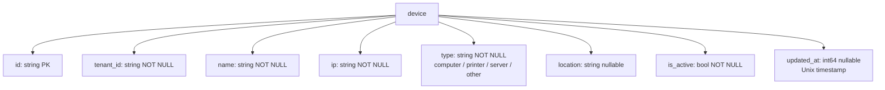

# device_manager — Database Diagram

```mermaid
flowchart TD
    A[device]
    A --> B[id: string PK]
    A --> C[tenant_id: string NOT NULL]
    A --> D[name: string NOT NULL]
    A --> E[ip: string NOT NULL]
    A --> F[type: string NOT NULL<br/>computer / printer / server / other]
    A --> G[location: string nullable]
    A --> H[is_active: bool NOT NULL]
    A --> I[updated_at: int64 nullable<br/>Unix timestamp]
```

> IP uniqueness is enforced per `tenant_id` in the service layer (`Module.CreateDevice`), not as a
> DB constraint.
