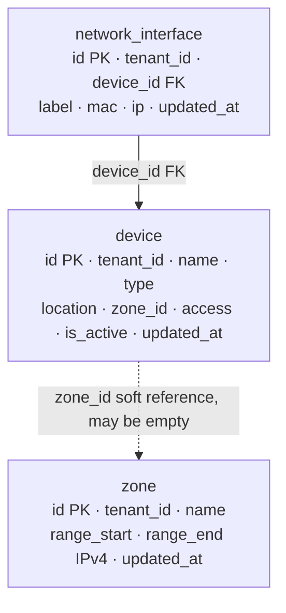

# device_manager — Database Diagram

- `device.type`: `computer` / `printer` / `server` / `other`.
- `device.access`: `local` / `internet_filtered` / `internet` (`webtyp.com/network` names).
- `network_interface.mac`: optional, canonical, unique per tenant when present; randomized MACs rejected.
- `network_interface.ip`: unique per tenant; auto-assigned from the device's zone when empty.
- Uniqueness and range rules are enforced in the service layer, per `tenant_id`, not as DB constraints.
